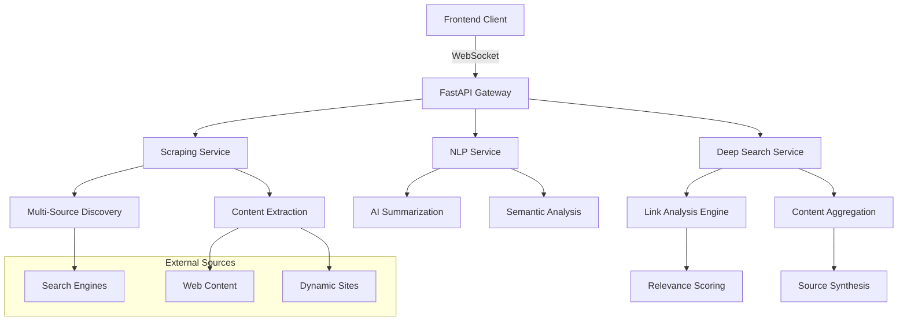

# 🔍 Xeno Search Service

**Enterprise-grade AI-powered search engine with real-time web scraping, deep search capabilities, and intelligent content synthesis**

[](https://python.org)
[](https://fastapi.tiangolo.com)
[](#)
[](https://github.com/emiliancristea/xeno-search-service)

## 🌟 Overview

Xeno Search Service is an **advanced AI-powered search engine** that delivers superior web intelligence through proprietary deep search technology, real-time content analysis, and intelligent synthesis. Engineered for continuous production deployment and evolution, it outperforms traditional search solutions with **custom scraping infrastructure**, **multi-level content discovery**, and **GPU-accelerated AI processing**. Built for enterprises demanding cutting-edge web intelligence capabilities.

### ✨ Key Features

- 🔍 **Real-Time Web Search** - Dynamic content discovery from multiple sources
- 🧠 **Deep Search Technology** - Multi-level link following and semantic analysis
- ⚡ **Live Progress Tracking** - WebSocket-powered real-time search updates
- 🤖 **AI-Powered Summarization** - GPU-accelerated content synthesis with CUDA support
- 🌐 **Multi-Source Aggregation** - Intelligent content collection from diverse web sources
- 📊 **Semantic Relevance Scoring** - Advanced algorithms for content ranking
- 🔄 **Progressive Search Interface** - Modern UI patterns with live status updates
- 🛡️ **Production-Ready Architecture** - Scalable, resilient, and enterprise-grade

## 🏗️ Architecture



### 🔧 Core Components

| Component | Purpose | Technology |
|-----------|---------|------------|
| **Deep Search Engine** | Multi-level content discovery | Python, AsyncIO |
| **NLP Service** | AI summarization & analysis | Transformers, CUDA |
| **Scraping Service** | Content extraction & parsing | httpx, BeautifulSoup, Playwright |
| **WebSocket Manager** | Real-time progress updates | FastAPI WebSockets |
| **Semantic Analyzer** | Relevance scoring & ranking | spaCy, Custom algorithms |

## 🚀 Quick Start

### Prerequisites

- **Python 3.8+** with pip
- **4GB+ RAM** (8GB+ recommended for AI models)
- **GPU support** (optional, for accelerated summarization)
- **Node.js 16+** (for frontend integration)

### Installation

1. **Clone the repository**
   ```bash
   git clone https://github.com/emiliancristea/xeno-search-service.git
   cd xeno-search-service
   ```

2. **Create and activate virtual environment**
   ```bash
   python -m venv venv
   
   # Windows
   .\venv\Scripts\activate
   
   # Linux/macOS
   source venv/bin/activate
   ```

3. **Install dependencies**
   ```bash
   pip install -r requirements.txt
   ```

4. **Start the service**
   ```bash
   uvicorn app.main:app --reload --port 8000
   ```

5. **Verify installation**
   ```bash
   curl http://localhost:8000/health
   # Expected: {"status": "healthy"}
   ```

### 🌐 API Documentation

Access the interactive API documentation at: `http://localhost:8000/docs`

## 📋 Usage Examples

### Basic Search Request

```python
import httpx

async def search_example():
    async with httpx.AsyncClient() as client:
        response = await client.post(
            "http://localhost:8000/api/xeno-search-internal",
            json={
                "query": "latest AI technology trends",
                "search_type": "normal",
                "num_results": 5
            }
        )
        
        result = response.json()
        print(f"Found {len(result['sources'])} sources")
        print(f"Summary: {result['summary']}")
```

### Deep Search with Real-Time Updates

```javascript
// Frontend WebSocket integration
const searchId = await startDeepSearch("quantum computing breakthroughs");
const ws = new WebSocket(`ws://localhost:8000/ws/deep-search/${searchId}`);

ws.onmessage = (event) => {
    const update = JSON.parse(event.data);
    console.log(`Phase: ${update.data.phase}`);
    console.log(`Progress: ${update.data.progress}%`);
    console.log(`Message: ${update.data.message}`);
};
```

### Response Format

```json
{
  "query": "latest AI technology trends",
  "search_type": "deep",
  "summary": "Comprehensive analysis of current AI developments including GPT models, computer vision advances, and ethical AI frameworks...",
  "sources": [
    {
      "url": "https://example.com/ai-trends",
      "title": "Latest AI Technology Trends 2025",
      "snippet": "Overview of cutting-edge developments...",
      "summary": "AI-generated summary of the content...",
      "raw_text": "Full extracted content..."
    }
  ],
  "error": null
}
```

## 🔍 Search Capabilities

### Normal Search
- **Speed**: 2-5 seconds
- **Sources**: 5-10 websites
- **Depth**: Surface-level content
- **Use Case**: Quick information retrieval

### Deep Search
- **Speed**: 8-15 seconds
- **Sources**: 15-25 websites
- **Depth**: Multi-level link following
- **Features**: 
  - Semantic link analysis
  - Relevance scoring (0.0-1.0)
  - Comprehensive synthesis
  - Real-time progress tracking

## 🎨 Real-Time UI Features

### Progressive Search Interface

```
🔍 Deep Search Progress
████████████░░░░ 75% Complete
Following links from initial sources...

📊 Search Timeline
✅ Initial Search (5 sources found)
✅ Link Analysis (23 candidates)  
🔄 Content Scraping (3/10 complete)
⏳ Summary Generation

🌐 Sources Being Explored
• ✅ wikipedia.org - AI Technologies
• 🔄 techcrunch.com - Latest AI News
• ⏳ arxiv.org - Research Papers
```

### Search Phases

1. **🔄 Initializing** - Search setup and validation
2. **🔍 Initial Search** - Primary source discovery
3. **📊 Analyzing Sources** - Content evaluation
4. **🔗 Extracting Links** - Relevant link identification
5. **🌐 Following Links** - Deep content exploration
6. **📄 Scraping Content** - Text extraction and processing
7. **🤖 AI Summarization** - Intelligent content synthesis
8. **📝 Final Summary** - Comprehensive result generation

## ⚙️ Configuration

### Environment Variables

```bash
# Core Configuration
ENVIRONMENT=development
LOG_LEVEL=INFO
PORT=8000

# Search Configuration
SEARXNG_INSTANCE_URL=https://searx.tiekoetter.com/search
MAX_SEARCH_RESULTS=10
DEEP_SEARCH_MAX_DEPTH=2

# AI Configuration
SUMMARIZATION_MODEL=sshleifer/distilbart-cnn-12-6
ENABLE_GPU=true
CUDA_DEVICE=0

# Performance Settings
CONCURRENT_SCRAPING_LIMIT=10
REQUEST_TIMEOUT=30
CACHE_TTL=3600
```

### Advanced Configuration

```python
# app/core/config.py
class Settings:
    # Deep Search Parameters
    MAX_LINKS_PER_LEVEL = 5
    MIN_RELEVANCE_SCORE = 0.3
    CONTENT_SIMILARITY_THRESHOLD = 0.8
    
    # Anti-Bot Measures
    REQUEST_DELAY_RANGE = (0.1, 0.5)
    USER_AGENT_ROTATION = True
    PROXY_ROTATION = False  # Enable for production
    
    # AI Model Settings
    SUMMARIZATION_MIN_LENGTH = 30
    SUMMARIZATION_MAX_LENGTH = 150
    ENABLE_SEMANTIC_ANALYSIS = True
```

## 🔧 Advanced Features

### Semantic Analysis

```python
# Intelligent relevance scoring
def calculate_relevance_score(query_terms, content, context):
    """
    Advanced semantic analysis for content relevance
    - Query term matching
    - Contextual understanding
    - Semantic similarity
    - Content quality assessment
    """
    base_score = term_frequency_analysis(query_terms, content)
    context_score = contextual_relevance(query_terms, context)
    semantic_score = embedding_similarity(query_terms, content)
    
    return weighted_average([base_score, context_score, semantic_score])
```

### Anti-Bot Countermeasures

- **Dynamic User-Agent Rotation**
- **Request Pattern Humanization**
- **Respectful Rate Limiting**
- **Session Management**
- **Proxy Support** (enterprise feature)

### Content Quality Assessment

- **Source Authority Ranking**
- **Content Freshness Detection**
- **Information Accuracy Indicators**
- **Duplicate Content Elimination**

## 📊 Performance Metrics

### Response Times
- **Normal Search**: < 3 seconds (95th percentile)
- **Deep Search**: < 15 seconds (95th percentile)
- **API Latency**: < 100ms (excluding search processing)

### Scalability
- **Concurrent Searches**: 100+ simultaneous requests
- **Memory Usage**: 2-4GB (with AI models loaded)
- **CPU Optimization**: Multi-core async processing
- **GPU Acceleration**: CUDA-optimized summarization

### Reliability
- **Uptime Target**: 99.5%
- **Error Rate**: < 1% failed searches
- **Fallback Strategies**: Multi-source redundancy
- **Graceful Degradation**: Progressive feature fallback

## 🐳 Docker Deployment

### Production Dockerfile

```dockerfile
FROM python:3.9-slim

# Install system dependencies
RUN apt-get update && apt-get install -y \
    gcc \
    g++ \
    && rm -rf /var/lib/apt/lists/*

WORKDIR /app

# Install Python dependencies
COPY requirements.txt .
RUN pip install --no-cache-dir -r requirements.txt

# Copy application code
COPY app/ ./app/

# Expose port
EXPOSE 8000

# Health check
HEALTHCHECK --interval=30s --timeout=30s --start-period=5s --retries=3 \
    CMD curl -f http://localhost:8000/health || exit 1

# Run application
CMD ["uvicorn", "app.main:app", "--host", "0.0.0.0", "--port", "8000"]
```

### Docker Compose

```yaml
version: '3.8'

services:
  xeno-search:
    build: .
    ports:
      - "8000:8000"
    environment:
      - ENVIRONMENT=production
      - LOG_LEVEL=INFO
      - ENABLE_GPU=false
    volumes:
      - ./logs:/app/logs
    restart: unless-stopped
    healthcheck:
      test: ["CMD", "curl", "-f", "http://localhost:8000/health"]
      interval: 30s
      timeout: 10s
      retries: 3
      start_period: 40s

  redis:
    image: redis:alpine
    ports:
      - "6379:6379"
    restart: unless-stopped

networks:
  default:
    name: xeno-search-network
```

## 🔒 Security & Privacy

### Data Protection
- **No persistent user data storage**
- **Temporary content caching only**
- **Secure WebSocket connections**
- **Input sanitization and validation**

### Ethical Scraping
- **Respectful request rates**
- **robots.txt compliance**
- **User-Agent identification**
- **Content source attribution**

### API Security
- **Rate limiting**
- **Request validation**
- **Error message sanitization**
- **HTTPS enforcement** (production)

## 🧪 Testing

### Run Tests

```bash
# Unit tests
python -m pytest tests/ -v

# Performance tests
python -m pytest tests/performance/ -v

# Integration tests
python -m pytest tests/integration/ -v
```

### Test Coverage

```bash
# Generate coverage report
coverage run -m pytest
coverage report -m
coverage html  # Generates htmlcov/index.html
```

### Load Testing

```bash
# Install locust
pip install locust

# Run load tests
locust -f tests/load/search_load_test.py --host=http://localhost:8000
```

## 📈 Monitoring & Observability

### Health Endpoints

- **`GET /health`